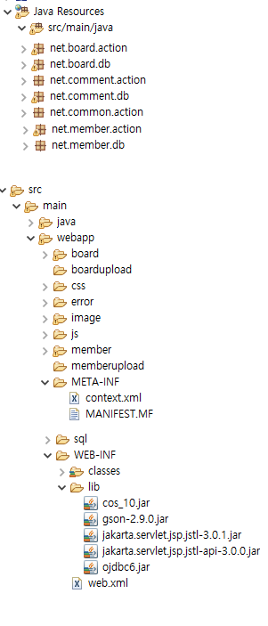

# 240315_과제solution

★(시험) : $.ajax json 형식에 들어가는 키값. (dataType 대문자T임)

## DAO 클래스

# １.join.jsp 아이디 중복검사 변경
## JSP

## Servlet

## DAO

## join.jsp 스크립트

★29 : 데이터를 보낼 때는 쿼리스트링 형식으로 보낼 수도 있다. id는 idCheck.java 16번 라인의 id와 동일해야 한다.

# ２.Board
