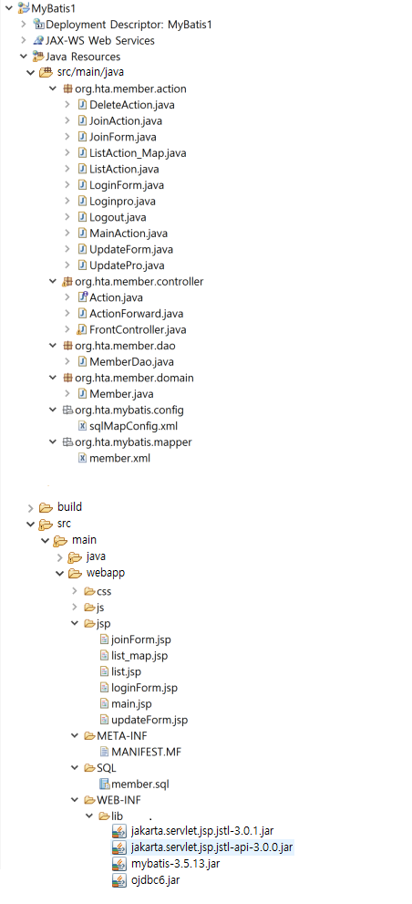

★select 에서만 resultType 속성이 존재한다.

# 퍼시스턴스 프레임워크 (Persistence framework)

★퍼시스턴스(Persistence) : 데이터의 지속성. 애플리케이션을 종료하고 다시 실행하더라도 이전에 저장한 데이터를 다시 불러올 수 있는 기술.
★프레임워크(Framework) : 라이브러리가 개발에 필요한 도구들을 단순히 나열해 놓은 것이라면, 프레임워크는 동작에 필요한 구조를 어느 정도 완성해 놓은 반제품 형태의 도구.

★SQL맵퍼(mapper) : SQL 문장으로 직접 DB 데이터를 다룬다. eg)mybatis
★객체 관계 맵퍼(Object-Relational mapper) : 자바 객체를 통해 간접적으로 DB데이터를 다룬다. eg)하이버네이트(Hibernate)와 탑링크(TopLink)
- 프레임워크에서 제공하는 API 전용 객체 질의어를 사용하여 데이터를 다룬다.

★mybatis
- 퍼시스턴스 프레임워크의 일종
- 자바 메서드와 SQL문을 연결하는 SQL 매핑 프레임워크
- JDBC 코드를 캡슐화하여 DB 프로그래밍을 단순화 시킴
- 자바 소스에서 SQL을 분리하여 관리함
- SQL을 개발자가 직접 제어 -> DBMS의 고유기능 사용 -> 최적화
- 배우기 쉽고 빠르게 적용할 수 있다

★Mybatis 핵심 컴포넌트
- SqlSession
  - SQL을 실행하는 객체. SQL을 처리하기 위해 JDBC드라이버를 사용한다.
- SqlSessionFactory
  - SqlSession 객체를 생성한다.
- SqlSessionFactoryBuilder
  - mybatis 설정 파일의 내용을 토대로 SqlSessionFactory 객체를 생성한다.
- mybatis 설정 파일
  - DB연결 정보, 트랜잭션 정보, mybatis 제어 정보 등의 설정 내용을 포함하고 있다. SqlSessionFactory를 만들 때 사용한다.
- SQL 맵퍼 파일
  - SQL문을 담고 있는 파일. SqlSession 객체가 참조한다.

https://mybatis.org/mybatis-3/ko/index.html

configuration

mapper.. configuration 과 다르다.

https://mvnrepository.com/artifact/org.mybatis/mybatis/3.5.15

★maven repisitory에서 관련 라이브러리를 다운 받는다..

★3.5.15의 jar 파일

## DTO 클래스(Data Transfer Object)

★DTO(Data Transfer Object)
- 계층 간(Controller, View, Business Layer) 데이터 교환을 위한 Java Bean을 의미한다. DTO는 로직을 가지지 않는 데이터 객체이고, getter / setter 메소드만 가진 클래스를 의미한다.

## JoinProAction.java

★17~18 : 파라미터name / property /  테이블 컬럼 : 3가지가 동일하면 스프링에서는 생략되는 것들이 많아진다.

## MemberDao

★Reader reader = Resource.getResourceAsReader("org/hta/mybatis/config/sqlMapConfig.xml")
★SqlSessionFactory sf = new SqlSessionFactoryBuilder( ).build(reader)
★SqlSession session = sf.openSession(true)
## sqlMapConfig.xml
★https://mybatis.org/mybatis-3/ko/getting-started.html

★1번 체크박스 체크(2023-12 IDE eclipse는 체크 해제가 디폴트로 되어 있음음)

### sqlMapConfig설명.xml

★XML 기술을 사용하여 작성하기 때문에 제일 먼저 XML 선언과 태그 규칙을 정의한 DTD 선언이 온다. DTD란 문서 형식 정의(Document Type Definition, DTD) 라는 컴퓨터 용어로, SGML(Standard Generalized Markup Language) 계열의 마크업 언어에서 문서 형식을 정의하는 것이다. SGML을 비롯해 HTML, XHTML, XML 등에서 쓰인다.
★\<configuration> 엘리먼트 : mybatis 설정 파일의 루트 엘리먼트
★\<typeAliases> 엘리먼트 : typeAliases 엘리먼트. 자바 클래스 이름(패키지 포함)에 대한 별칭을 설정하는데 SQL 맵퍼 파일에서 사용할 별칭들이다.
- type 속성값 : 패키지 이름을 포함한 클래스 이름.
- alias 속성값 : type에서 지정한 클래스의 별칭.
★\<environments>엘리먼트 : 프레임워크에서 사용할 데이터베이스 정보(트랜잭션 관리자, 데이터 소스)를 설정한다. 이 태그를 이용하면 여러 개의 데이터베이스 접속 정보를 설정할 수 있다. 설정된 정보 중에서 하나를 선택할 때 default 속성을 사용한다.
- \<environment> 엘리먼트 : 각각의 데이터베이스 접속 정보를 정의한다. id속성은 \<environment>를 구분할 때 사용할 식별자다.
★\<transactionManager> 엘리먼트 : 트랜잭션 관리 유형 2가지. type에서 설정한다.
- (1)JDBC : 직접 JDBC의 commit, rollback 기능을 사용하여 mybatis 자체에서 트랜잭션을 관리한다.
- (2)MANAGED : Java EE 애플리케이션 서버(JBoss, WebLogic, WebShpere)나 서블릿 컨테이너(톰캣 서버)에서 트랜잭션을 관리한다.
★\<dataSource> 엘리먼트 : mybatis는 JDBC 표준 인터페이스인 javax.sql.DataSource 구현체를 이용하여 DB connection을 다룬다.
- \<dataSource type="POOLED">
-   \<property name="driver" value="oracle.jdbc.drvier.OracleDriver" />
-   \<property name="url" value="jdbc:oracle:thin:@localhost:1521:xe"/>
-   \<property name="username" value="scott"/>
-   \<property name="password" value="tiger"/>
- \<dataSource>
★\<mappers> 엘리먼트 : SQL맵퍼 파일들의 정보를 설정할 때 사용한다. 각각의 SQL맵퍼 파일의 정보는 \<mapper>태그로 정의한다. 자바의 클래스 경로를 사용하는 방법으로 resource 속성을 사용한다.
- \<mapper resource="org/hta/mybatis/mapper/member.xml"/>

## member.xml

★SQL 맵퍼 파일은 루트 앨리먼트 \<mapper>를 작성하는 것으로 시작한다. 프로젝트에서 기본적으로 여러 개의 \<mapper>를 가지기 때문에 중복되는 이름을 가진 SQL문이 존재할 수 있다. 따라서 각 \<mapper>마다 namespace 속성을 이용하여 \<mapper>를 구분한다.

### memberDao_설명

★mybatis 프레임워크의 핵심 컴포넌트
- (1)SqlSession : 실제 SQL을 실행하는 객체로 이 객체는 SQL을 처리하기 위해 JDBC드라이버를 사용한다.
- (2)SqlSessionFactory : SqlSession 객체를 생성한다.
- (3)SqlSessionFactoryBuilder : 마이바티스 설정 파일(config)의 내용을 토대로 SqlSessionFactory를 생성한다.
- (4)mybatis 설정 파일(config) : 

## MemberDao (2)

★36 : namespace.id 형태. 다음 매개변수로 파라미터를 입력한다

### memberDao_설명

## MemberDao(3)

## member.xml (mapper파일 작성)

★

## LoginProAction.java

## LogoutAction.java

## ListAction.java

## List\<Member> list( )

## member.xml

★id="list"

## list.jsp

  