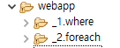
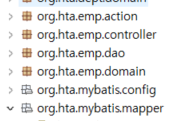

★DB 테이블 컬럼명 = DTO 클래스(자바빈)의 프로퍼티
- mybatis 활용 조건
- getter / setter 호출해서 작업했던 것들을 mybatis를 통해 처리하면서 코드가 줄어든다.
★spring 에서는 form태그 name 속성 값 = 테이블 컬럼명 = 프로퍼티
- request.getParameter( )를 사용할 필요가 없어진다!!

# 수정 / 삭제 이어서

★data 속성과 script를 활용해서 수정/삭제에 필요한 id값을 다음 페이지로 넘김.

## UpdateFormAction.java

## UpdateProAction.java

★16~18 : 스프링들어가면 이런 코드들이 사라진다.

## MemberDao.java

★delete / update

## member.xml

## DeleteAction.java

# mybatis로 동적쿼리 만들기 (MyBatis2)

## NewFile.jsp

## FrontController.java

## Term.java

★DTO 클래스 프로퍼티로 없는 정보는 보통 Map을 이용해서 담는다!!
- ArrayList / Map 중요하다!! 꼭 복습하기

## Emp.java

## sqlMapConfig.xml

## EmpDAO.java
### getSession( ) 메소드

### getTermList( ) 메소드

## emp.xml

★\<select> 엘리먼트의 resultType 속성은 config(환경설정)에서 type 속성에 대한 alias를 주었기 때문에 emp로 간단하게 쓸 수 있다.

## list1.jsp

## Newfile2.jsp

## emp.xml

★17 : map과 같이 자주 쓰는 클래스는 프레임워크 내부에서 이미 별칭으로 지정해 둠 -> "java.util.Map" 형식으로 쓰지 않고 "map"으로 별칭을 입력할 수 있다

## NewFile3.jsp

## Term3.java

## EmpDAO.java
### getTermList3( ) 메소드

## emp.xml

# checkbox 활용
## Check.jsp

★checkbox name 속성은 동일해야 한다. getParmeterValues( ) 메소드로 값을 가져오면, String 배열 형태로 저장된다.