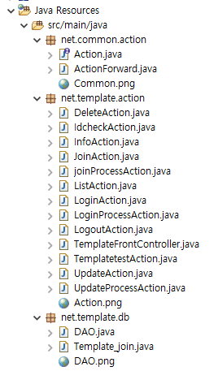
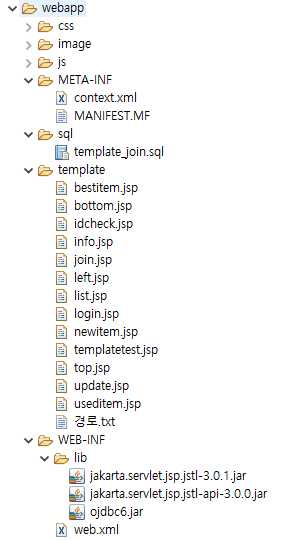

# 240308과제_solution

★유효성 검사 하는 부분 빼먹었다..
★HTMl 태그에 required 속성을 주거나 /  jQuery를 통해 유효성 검사를 할 수 있다.

★to_char 이용할 수 있다.

★34 : "%" + search_word + "%" 형식으로 작성한 후에 setString을 이용해야 ''로 인해 발생하는 문제를 해결할 수 있다.

# １.EL(Expression Language)

## 취미를 1개만 체크했다

★취미를 하나만 체크하면, "독서, " 이렇게 출력된다. 이걸 해결하는 방법은 EL 말고 다른 방법 활용해야 한다.

## 리터럴 표현식

## empty 연산자

# ２.JSTL

## 코어 라이브러리

★mvnrepository : 메이븐 레포지토리. 필요한 라이브러리를 다운받을 수 있다
- 스프링에서는 pom.xml에 \<dependnecy> 태그로 넣어주면 라이브러리를 알아서 관리해준다

★JSP 페이지에 등록 후 사용해야 한다
- \<%@ taglib prefix="c" uri=~~ %>
- prefix="c" : 사용할 태그의 네임스페이스 이름
- 

★\<c:out value='${test}' />
★${ } : 형태로 작성해야 변수 값을 출력한다

★<c:remove var="test"> : "test" 이름의 변수 제거 태그

★<c:catch var="err">  <%=10 / 0%>  </c:catch>
- <c:out value='${err}' />

★리터럴 표현식이 false면 전체 내용이 출력되지 않는다.

★JSP 주석을 사용하지 않으면 주석도 인식한다 조심!!

## 문제

## 문제2

## out

★Cross-Site Scripting(XSS)
★escapeXml=false : html태그를 인식한다

### 확인

★개발자도구 - elements

★개발자도구 - source

★페이지 소스 보기 창

## (중요) forEach

★\<c:forEach var="test" begin="1" end="10" step="2"> <\/c:forEach>

★varStatus

## empty 연산자

★session.invalidate( ) 주석을 풀면 이렇게 된다..

## url

## EL로 바꾸기

★\_2.list.emp\/list.jsp 를 el 형식으로 바꾸기
★el로 바꾸는 부분은 출력과 관련된 부분이라는 것 큰 흐름을 잡고 코드를 보면 용이하다.

★46~53 : getter 호출할 필요없이 EL 형식을 이용해서 값을 얻어올 수 있다.

# ３.MVC 패턴

★작업을 분리한다

★모든 요청을 하나의 서블릿으로 (Front Controller)

★Dynamic web module version -> 5.0 으로!!!

★context 경로로 들어오면 welcome-file 태그로 지정한 경로를 먼저 참조한다. -> 보이는 창은 기본으로 되어있는 설정이어서 별도로 입력할 필요 없긴 함

★index.jsp 생략하고 이렇게만 써도 된다.

★모든 프로젝트마다 index.jsp를 먼저 만들면 처음시작하는 페이지처리를 쉽게 할 수 있다.
★JSP에서는 컨텍스트 경로와 프로젝트 이름이 일치하는데, 스프링에서는 그렇지 않다.

★web.xml

★서버의 web.xml 형태가 이렇게 되어 있음

