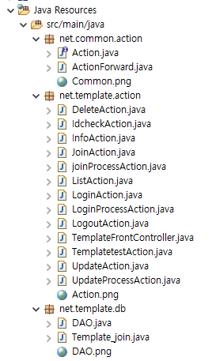
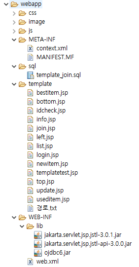
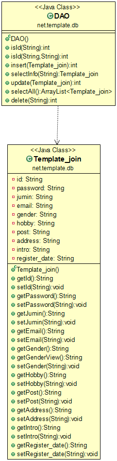

# 1.MVC 패턴
 <br>
★작업을 분리한다 <br>
 <br>
★모든 요청을 하나의 서블릿으로 (Front Controller) <br>
<br>
 <br>
 <br>
 <br>
 <br>
★Dynamic web module version -> 5.0 으로!!! <br>
<br>
 <br>
★context 경로로 들어오면 welcome-file 태그로 지정한 경로를 먼저 참조한다. -> 보이는 창은 기본으로 되어있는 설정이어서 별도로 입력할 필요 없긴 함 <br>
 <br>
★index.jsp 생략하고 이렇게만 써도 된다. <br>
 <br>
★모든 프로젝트마다 index.jsp를 먼저 만들면 처음시작하는 페이지처리를 쉽게 할 수 있다. <br>
★JSP에서는 컨텍스트 경로와 프로젝트 이름이 일치하는데, 스프링에서는 그렇지 않다. <br>
 <br>
★web.xml <br>
 <br>
★서버의 web.xml 형태가 이렇게 되어 있음 <br>
<br>
<br>
## top.jsp
 <br>
 <br>
★id가 admin인 경우에만 회원과 관련된 정보를 알려준다 (admin것은 제외) <br>
★모든 주소가 .net 형식으로 끝난다 <br>
<br>
<br>
## TemplateFrontController
 <br>
★doProcess / doGet / doPost 한 서블릿이 모든 방식을 처리할 수 있도록 작업한다 <br>
<br>
★인터페이스 추상 메소드 선언을 해줘야, 모든 클래스에 메소드를 활용할 수 있다. <br>
★ActionForward는 처리 후, 다음으로 이동할 페이지를 지정하기 위해. <br>
<br>
<br>
## Action 인터페이스
 <br>
★왜 인터페이스를 써야 할까? 모든 클래스에서 인터페이스를 implements 하면.. 구현한 모든 클래스에서 excute 메소드를 구현해야 한다 <br>
<br>
<br>
## ActionForward
★다음으로 넘어갈 페이지 redirect / forward방식.. 결정 <br>
 <br>
<br>
<br>
# 과제
 <br>
★콘솔에 이렇게 출력되도록 코드 작성해보기<br>
★substring 이용하기


# 내가 작성한 과제
```JAVA
	protected void doGet(HttpServletRequest request,
	HttpServletResponse response) throws ServletException, IOException {
//		doProcess(request, response);
	String RequestURI = request.getRequestURI();
	String ContextPath = request.getContextPath();
	int ContextPathleng = ContextPath.length();
	String command = RequestURI.substring(ContextPathleng);
	System.out.println(ContextPathleng);
	System.out.println("RequestURI = " + RequestURI);
	System.out.println("contextPath = " + ContextPath);
	System.out.println("command = " + command);
	}
```
★request객체와 response객체가 선언되어 있는 곳에서 getRequestURI( ) 메소드와 getContextPath( ) 메소드를 호출한 후, 그 둘의 관계를 보고 substrig( ) 메소드를 활용하여 원하는 command 문자열을 구할 수 있었다.


## TemplateFrontContrloler (2)

★TemplateFrontController에서 nullpointer exception 발생하면 생각해보자 주소를 잘못입력한 것이다!! Action action = null; 인 상태로 있을 테니까!!!
★주소에 (1)http://localhost:8088/JSP_Template_JSTL/templatetest.net (2)http://localhost:8088/JSP_Template_JSTL/ (3)http://localhost:8088/JSP_Template_JSTL/index.jsp
모두 같은 결과가 나와야 한다. <br>
 <br>


## TemplatetestAction


## templatetest.jsp
★EL로 수정


★수정후에 위에 (1) (2) (3) 중에 하나 입력하면 

★이렇게 화면이 떠야 한다


## left.jsp

★연결될 주소를 templatetest.net으로 변경해준다. 넘기는 파라미터와 value는 그대로 한다


## LogoutAction.java

