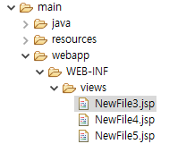

# Spring Boot

📌왜 spring boot를 쓸까? [코드스테이츠 블로그_스프링/스프링부트](https://www.codestates.com/blog/content/%EC%8A%A4%ED%94%84%EB%A7%81-%EC%8A%A4%ED%94%84%EB%A7%81%EB%B6%80%ED%8A%B8)
- 스프링 부트는 스프링에서 진행한 기존의 복잡한 초기 설정을 간단하게 해준다. 즉, 스프링 부트는 스프링으로 애플리케이션을 만들 때 필요한 설정을 간편하게 처리해주는 별도 프레임워크이다. 스프링 부트를 사용하면 기존에 어려운 초기 설정에 쏟아야 했을 시간과 노력을 절약하여 비즈니스 로직을 구현하는데 집중할 수 있다.
- 기존에는 배포할 때 별도 외장 웹 서버를 설치하고 프로젝트를 War 파일로 빌드하여 배포를 진행했는데, 이러한 방식은 처리 속도가 느리며 번거롭다는 단점을 가진다. 반면, 스프링 부트는 자체적인 웹 서버를 내장하고 있어 빠르고 간편하게 배포를 진행할 수 있다. 또한, 스프링 부트를 사용하면 독립적으로 실행 가능한 Jar 파일로 프로젝트를 빌드할 수 있어, 클라우드 서비스 및 도커와 같은 가상화 환경에 빠르게 배포할 수 있다.
📌configuration : 구성 / 설정
📌@SpringBootApplication
- (1)자동 설정을 담당하는 annotation으로 스프링 부트의 자동 설정, 스프링 bean 읽기와 생성이 모두 자동으로 설정된다.
- (2)SpringBootApplication annotation이 포함하고 있는 3가지 annotation은 다음과 같다
  - ①@SpringBootConfiguration
    - Spring Boot 애플리케이션의 @Configuration을 제공함을 나타낸다. 즉, 클래스가 Spring Boot의 구성 클래스임을 나타낸다.
  - ②@ComponentScan
    - @SpringBootApplication이 있는 폴더를 기준으로 하위 폴더 모두를 스캔해서 bean으로 등록한다.
    - 예) @Component, @Configuration, @Repository, @Service, @Controller, @RestController .. 위 annotation을 인식하게 하기 위해서는 @SpringBootApplication이 있는 패키지부터 하위 패키지에 작성하면 된다.
  - ③@EnableAutoConfiguration
    - @ComponentScan으로 bean이 등록된 이후, @EnableAutoConfiguration를 통해 한 번 더 스캔되는데 그 때 등록되는 bean들을 설정하기 위해 사용되는 다양한 bean들이 등록된다.
    - 참고) Maven Dependencies 선택 -> spring-boot-autoconfigure-3.1.10.jar -> META-INF/spring/spring.factories -> 이곳에 설정 관련된 정보들이 key와 value 형태로 저장되어 있다. 이 파일을 참조하여 여러 가지 bean을 생성한다.

📌port 8080은 oracle에서 사용 중

📌정적인(.css/.js) 등은 static 폴더에 넣어서 관리한다.
📌templates 폴더는 Thymleaf 사용과 관련있다.

📌server.port=8088(현재 사용중이지 않은 port)로 port를 변경하면 에러 발생하지 않는다.

## @RestController

📌@RestController : response.getWriter( ) 역할과 동일하다. view페이지나 어떤 주소로 이동하는 것이 아닌, 현재 페이지에 값을 던져주는 기능을 한다.

## Dependency에 devtools 적용하여 실행

📌변경 사항을 서버를 리셋 하지 않고 적용할 수 있다. 

### JSP 파일 사용하기 (1)

📌spring.mvc.view.prefix -> view 페이지 경로를 붙여준다
📌spring.mvc.view.suffix -> view 페이지 확장자를 붙여준다

### JSP 파일 사용하기 (2)

📌jsp 처리를 위해 dependency를 3개 추가한다.

📌이렇게 사용할 수 있는 컨트롤러를 만들어야 한다.

## 컨트롤러 작업

📌스프링은 기본적으로 forwarding 방식이다(redirect 방식으로 페이지를 이동하려면 코드를 추가해야 한다).

## CSS 경로확인

★css/js파일은 webapp 하단에 넣는 것이 아니라 src/main/resources -> static 폴더 안에 넣어서 관리한다.

## annotation 연습

### LoginController.java

📌@Controller
- @Controller 어노테이션을 사용한 컨트롤러 클래스를 이용해서 특정 요청 URL을 처리한다.
- @Component를 상속한 @Controller는 @Controller가 붙은 클래스의 객체를 메모리에 생성하는 기능을 제공한다
- 단순히 객체를 생성하는 것에 그치지 않고 DispatcherServlet이 인식하는 Controller객체로 만들어 준다.
- 스프링 컨테이너는 @Controller가 선언된 클래스의 객체를 자동으로 Controller 객체로 인식한다.

📌@ㄲ
- @RequestMapping 어노테이션을 사용해서 메소드에 처리할 요청 경로를 지정한다. value="요청 경로", method는 전송 방식을 지정한다.
- @RequestMapping 뒤에는 반드시 메소드가 나와야 하고 자동 호출 된다.
- 메소드 이름은 다른 메소드들과 중복되지 않게만 작성한다.
- post방식과 get방식을 모두 적용할 경우에는 method={RequestMethod.POST, RequestMethod.GET} 또는 생략한다.

★dispatcher에 의해 요청 / 처리가 이뤄진다.

### loginForm.jsp

### ModelAndView 객체 활용

★ModelAndView 이용해서 데이터 전달 방법
- 스프링에서 Model 객체는 컨트롤러에서 생성된 데이터를 담아서 jsp 페이지에 전달하는 역할을 한다.
- 서블릿에서 request.setAttribute( )와 유사한 역할을 한다.
- 전달할 데이터와 View 페이지 정보를 한꺼번에 저장할 수 있는 객체는 ModelAndView이다.
- ModelAndView에서 데이터를 저장할 때 사용하는 메소드는 addObject(String, Object)이다.
    - addObject의 첫번째 매개변수는 키(key), 두번째 매개변수는 값(Value)을 의미한다.
    - bbs는 id와 pass가 저장되어 있는 VO(Value Object, 도메인에서 한 개 또는 그 이상의 속성들을 묶어서 특정 값을 나타내는 객체)객체 이다.
    - ModelAndView에 값을 저장한 것은 WEB-INF/views/login/list.jsp에서 EL로 나타낼 수 있다.
    - ID : ${bkey.id} / pass : ${bkey.pass}

★WEB-INF/views/login/list.jsp의 내용이 보이지만 포워딩되어 있는 주소는 \http://localhost:8088/myhome3/login_ok1.do를 나타낸다. redirect를 원하면 'redirect:' 접두사를 붙인다.

### BbsBean.java (Value Object)

### list.jsp

### Model 객체 활용

★Model 객체를 이용해서 데이터 전달 방법
- View페이지에 대한 정보는 반환형 String에 나타낸다.
- mv.addAttribute("bkey", bbs);

#### LoginController2.java

★①input 태그의 name 속성 ②프로퍼티 (③테이블 컬럼-mybatis이용할 때) 일치시켜주면,, request.getParmeter( ) 하지 않아도 된다..

★command 객체?
- 스프링은 요청 파라미터 값을 command 객체에 담아주는 기능을 제공한다.
- command 객체에는 파라미터로 넘어 온 값들을 저장할 setter 메소드가 존재해야 한다. 즉, 파라미터의 이름과 property의 이름이 같으면 된다. ex)loginForm2.jsp에서 \<input type="text" name="id">에서 입력한 값을 저장하기 위해  setId( ) 메소드가 command 객체에 존재하면 된다.
- String id =  request.getParameter("id");  String pass = request.getParmeter("pass");  BbsBean bbs = new BbsBean( );  bbs.setId(id);  bbs.setPass(pass);  command 객체를 사용하면 위의 코드 기능을 수행하므로 위의 코드들은 필요 없게 된다.
- command 객체에 저장된 값을 JSP에서 사용하기 위해서 ${bbsBean.id} 또는 ${bbsBean.pass}로 사용한다. 즉, list2.jsp에서 command 객체의 클래스 이름(첫 글자를 소문자로 바꾼다)과 프로퍼티를 이용해서 출력하면 된다. ex)command 객체의 클래스 이름이 BbsBean인 경우, JSP 코드에서는 bbsBean이라는 이름을 사용해서 command 객체에 접근할 수 있게 된다.

### @ModelAttribute

★command 객체에 접근할 때 사용할 속성명을 변경하고 싶다면 @ModelAttribute를 사용한다.
- @ModelAttribute("hoho") BbsBean bbs -> view페이지에서 "hoho"라는 이름으로 사용할 수 있다.
- \<th>ID\</th>\<td>${hoho.id}\</td>

## 파라미터 (command 객체에 담을 수 없는 정보 전달)

★@RequestParam(value="age") int age
- 파라미터 age의 값을 정수형 변수 age에 저장하라는 의미
- String으로 넘어오는 파라미터의 값을 변수형에 맞추어 캐스팅한다.
- int age = Integer.parseInt(request.getParameter("age"));

### ParamController2_int.java

★@RequestParam(value="age")에서 @RequestParam(value="age2")로 수정
- HTTP Status 400 - Bad Request Message Required int parameter 'age2' is not present

★400오류 발생 해결법
- Optional int parameter 'age2' is present but cannot be translated into a null valude due to being declared as a primitive type.
- required=false로 400오류는 발생하지 않지만 넘어온 값이 null이라 이것을 기본형 int형으로 변환하면서 500에러 발생.

#### 파라미터가 항상 넘어올지 확신할 수 없는 경우

★오류 수정 방법 : age2라는 파라미터가 없는 경우 기본값으로 10을 설정한다.
- (@RequestParam(value="age2", defaultValue="10", required=false) int age, Model model)

#### 파라미터가 항상 넘어오는 경우

★int age : 파라미터와 같은 이름의 변수에 저장할 경우, 이와 같이 작성하면 된다.
- (int age, Model model, HttpServletRequest request)