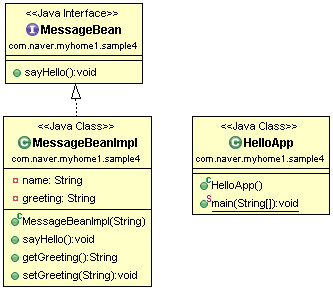
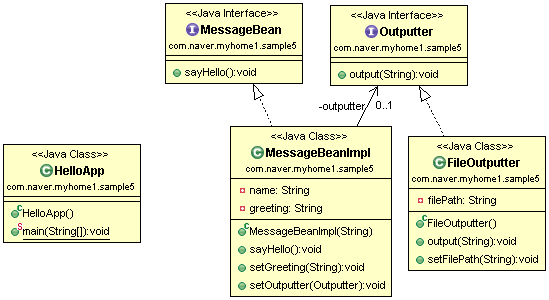

# 스프링 시작

★Spring boot. 복잡한 설정을 쉽게 설정할 수 있도록 만들어주는 도구.
★snapshot : 개발 중이라는 의미

★콘솔창에 한글이 깨지는 경우 해결
- Encoding MS949
- https://ssollacc.tistory.com/12

## 다형성 활용

## BeanFactory

★내가 필요한 객체를 직접 생성하지 않는다!!

## 스프링 방식으로 Bean공장 생성
### applicationContext.xml

### applicationContext설명

★의존성 주입(Dependency Injection, DI) : 객체 사이의 의존 관계가 자기 자신이 아닌 외부에 의해서 설정된다는 개념으로 의존하는 객체를 직접 생성하지 않고 전달받는 방식을 사용한다. 

### HelloApp.java

★14~15 : 설정 파일을 읽으면서 \<beans> 루트 엘리먼트의 \<bean> 태그로 정의된 bean을 생성한다 -> 20 : ctx.getBean( ) 메소드를 통해 생성된 객체(빈)을 검색한다(dependency lookup) -> 23 : 해당 객체의 메소드를 호출한다 -> 26 : 사용한 Spring 컨테이너를 닫는다 (더 이상 bean 객체를 사용할 수 없다)

## sample4

### 자바 방식으로 해결

### 스프링 방식으로 해결

★해당 빈에 관련된 생성자 / setter 에 관한 설정을 해야 하므로 \<bean>태그 안에 넣어야 한다.
★ 

## sample5

### FileOutputter.java

### MessageBeanImpl.java

### 자바 방식으로 접근

★8 : 경로를 입력하지 않고, 파일 이름을 입력할 경우 context 경로에 해당 파일이 만들어진다.

### 스프링 방식으로 접근

★프로퍼티에 String이나 기본형 변수가 아니라, 다른 참조형 변수가 쓰일 수도 있다. 해당 객체를 생성한 후에 \<ref  bean=""> 태그를 활용하면 만들어진 bean을 활용할 수 있다.
★24 : id와 20 ref 태그 bean 속성 같아야 한다.

## 애애노테이션 활용

### HelloApp.java

★print( ) 메소드를 활용하기 위해 객체 생성 후 setBean 메소드를 통해 주입한다.

### aplicationContext.xml

★10 : property의 개념!! set / get 뒤의 명칭이 bean의 property에 해당한다. setBean에 m이라는 객체(bean)을 `주입` 한다.

### applicationContext1.xml

★29 ~ 31 : @Autowired 활용으로 자동 주입되면서 주입하는 코드를 입력하지 않아도 된다.

### MessageMultiple.java

★24 : 해당 타입에 할당할 수 있는 bean 객체를 찾아서 자동으로 주입한다. 반드시 주입할 의존 객체가 존재해야 한다.

### HelloApp_Autowired.java

## 애노테이션 활용2
### MessageBeanKo.java

### HelloApp_Qualifier.java

★이런 오류가 발생한다...  Autowired를 하려고 하는데, m/m1 두 가지가 모두 Messagebean 타입이다.

### MessageMultiple.java

★Qualifier 설정 관련 오류 프로젝트 할 때 많이 발생한다.

★applicationContext2.xml \<bean> 태그에 입력한 대로 bean이 형성되지만, @Qualifier 애노테이션을 통해 구체적으로 명시해주면 @Autowired에 주입할 객체를 분명히 해줘서 에러가 더 이상 발생하지 않는다.
