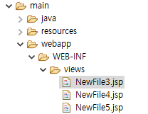

# sample3
## @Resource

# sample4
## context:component-scan

★\<context:component-scan/> 태그를 사용하여 특정 패키지 안의 클래스들을 스캔하고 annotation을 확인 후 bean을 생성한다. @Component 등이 붙은 bean 생성 표시자(annotation)가 ㄷ있는 클래스를 객체로 생성한다.
★\<context:component-scan/>를 선언하면 자동으로 \<context:annotation-config/> 태그의 기능이 활성화 되므로 \<context:annotation-config/> 태그를 제거한다.
★\<context:component-scan base-package="com.naver.myhome.sample4"/>

## @Component
### MessageBeanEn.java

★5 : @Component("m")

### MessageBeanKo.java

★5 : @Component("m1")

### MesageMultiple.java

★@Resource(name="m")

### HelloApp_Component.java

★@Component 사용해보기
- spring 컨테이너가 component-scan에 의해서 자동으로 bean 등록할 대상으로 지정된다.
- 이 때 bean의 이름을 지어줄 수 있는데 방법은 @Component("bean의 이름")하면 된다.
- 이름을 사용하지 않으면 지정한 클래스의 이름에서 첫글자를 소문자로 바꾼 이름으로 bean이 생성된다.
  - 예) @Component
  -       public class MessageMultiple { }의 경우
  -       MessageMultiple bean = (MessageMultiple) ctx.getBean("messageMultiple")

# sample5_1
## @Value

### ReadMain.java

# sample5_2
## data.properties

## 프로퍼티 파일을 이용해서 값 주입

★.properties 파일을 이용해서 값을 주입하는 방법
- (1)context 네임스페이스의 property-placeholder 태그를 추가하고 앞에서 만든 프로퍼티 파일 위치를 지정한다
- (2)@Value를 이용해서 값을 가져온다.
    - @Value의 주요 용도 : 외부 설정 파일에서 값을 가져와서 bean 필드에 주입할 수 있다.
    - 예) ①data.properties -> path=out200.txt
    -       ②자바파일에서 @Value와 "${프로퍼티 키}"로 접근
    -          @Value("${path}")
    -          private String filePath

# sample6
## data.properties

★properties 파일에 입력한 한글은 유니코드로 자동 변환.

## FileOutputter.java

## MessageBeanImpl.java

★11~15 : bean 만들면서 @Value로 설정한 값이 자동으로 주입된다. (setter가 필요없음!)
★19~23 : 생성자에 매개변수를 입력하는 경우에는 객체를 주입하는 방법을 보통 사용한다. @Component 어노테이션을 사용하여 객체를 자동으로 생성하면 생성자에 다른 값을 입력할 수가 없기 때문에.. 

# Spring MVC

★configuration : 구성 / 설정

★port 8080은 oracle에서 사용 중

★정적인(css/js) 등은 static 폴더에 들어간다.
★templates 폴더는 Thymleaf 사용과 관련있다.

★server.port=8088로 port를 변경하면 에러 발생하지 않는다.

★@RestController : response.getWriter( ) 역할과 동일하다.

## devtools 적용하여 실행

★JSP 사용하려면 2가지 작업을 해줘야 한다....

★이렇게 사용할 수 있는 컨트롤러를 만들어야 한다.

## 컨트롤러 작업

★스프링은 기본적으로 forwarding 방식이다.

## CSS 경로확인

★css/js파일은 webapp 하단에 넣는 것이 아니라 src/main/resources -> static 폴더 안에 넣어서 관리한다.

## annotation 연습

### LoginController.java

★dispatcher에 의해 요청 / 처리가 이뤄진다.

### loginForm.jsp

### ModelAndView 객체 활용

### BbsBean.java

### list.jsp

### Model 객체 활용

#### LoginController2.java

★일치시켜주면,, request.getParmeter( ) 하지 않아도 된다..

### @ModelAttribute

## 파라미터 (command 객체에 담을 수 없는 정보 전달)

### ParamController2_int.java

#### 파라미터가 항상 넘어올지 확신할 수 없는 경우

#### 파라미터가 항상 넘어오는 경우

