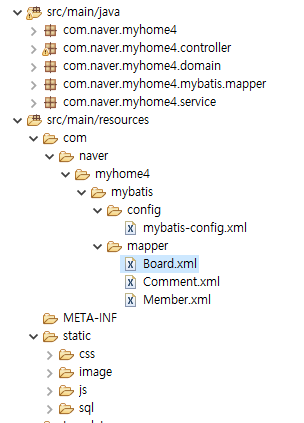

# Boot Dashboard

📌Boot Dashboard 활용하면 프로젝트를 관리하기 편함.

# CheckForm

## CheckFormController.java

## list1.jsp

📌코어 태그 라이브러리 / jQuery 이용해서 체크해서 전송한 것이 체크되어 있도록 작업할 수 있다.

# Redirect
## RedirectController.java

📌redirect 하려면 value 값 앞에 redirect: 형태로 붙여주면 된다.
## output.jsp

📌12 : JSP에서 스크립트릿을 활용해 세션 객체에 담긴 속성을 제거할 수 있다.
`<%session.removeAttribute("message")%>`

## 스프링 코드로 변경 (RedirectAttributes / addFlashAttribute)

📌`addFlashAttribute() 메소드`는 일회성으로 데이터를 전달한다.

### 쿼리스트링 형태로 보내기

📌RedirectAttributes의 `addAttribute() 메소드`를 통해 쿼리스트링 형태로 파라미터와 값을 보낼 수 있다.
- \http://localhost:8088/myhome3/output3?attr=addAttribute

## Json형태로 보내기
### response.getWriter( ).print( )

📌@RequestMapping 애노테이션 하단 메소드의 반환형이 String이면, 이동할 페이지를 의미한다.

📌`HttpServletResponse response`
`response.setContentType("text/html;charset=utf-8");`
`response.getWriter().print("");`

###  @ResponseBody

📌반환형이 `String`이고 `@ResponseBody` 가 있으면 문자열을 응답으로 보낸다. -> `리턴되는 문자열이 주소에 대한 정보가 아니라 응답으로 보내 브라우저에 보인다`
📌`Ajax 활용할 때 아이디 중복 검사 등도 이렇게 @ResponseBody`에 실어서 보내면 될 것 같다.

#### Json 형식으로 가는지 확인

📌bean 참조변수가 가리키고 있는 주소만 나온다

#### 제대로 보내보기

📌response.getWriter( ).print(bean) 형태로 보내는 게 아니라, 값을 담은 다음에 `return bean` 형태로 보내야 한다.

## @RestController

📌`@RestController = @ResponsBody + @Controller`

# 스프링 MVC 구조

📌Service와 DAO를 Interface 로 구현하는 것은 개발자의 선택이다.
📌

## service 계층 설명

## 구조도

## application.properties

📌14 : 지정해주지 않으면, 클래스명으로 별칭 자동 만들어줌
📌20~22 : mapper 로그를 가장 자세하게 찍어주는 trace 값을 입력.

## Member DTO 클래스 작성

📌12 : command 객체의 특성을 활용하기 위해 name / 프로퍼티 / 컬럼 3가지를 일치시킨다.

## Board DTO 클래스 작성

## Comment DTO 클래스 작성

## Mapper 인터페이스 활용

## mapper xml 설정

📌인터페이스 위치 / 이름을 잘 맞춰서 작성해야 한다.

## mybatis-config.xml

## interface로 service layer 구현

## memberController.java

## member_loginForm.jsp

### 회원가입 폼으로 이동

## ID유효성검사
### member_joinForm.jsp

📌27 : idecheck로 변경.

### (1)컨트롤러 처리

###  (2)MemberServiceImpl.java

### (3)Member.xml

📌resultType 속성은 대소문자 구분하지 않는다.

📌trace를 통해 어떤 값이 오고가고 있는지 콘솔에서 확인할 수 있다.

📌브라우저 개발자메뉴에서 네트워크를 통해 오고가는 값을 확힌할 수 있다.

## 회원가입 처리
###  (1)MemberController.java

### (2)service 처리

### (3)xml 처리