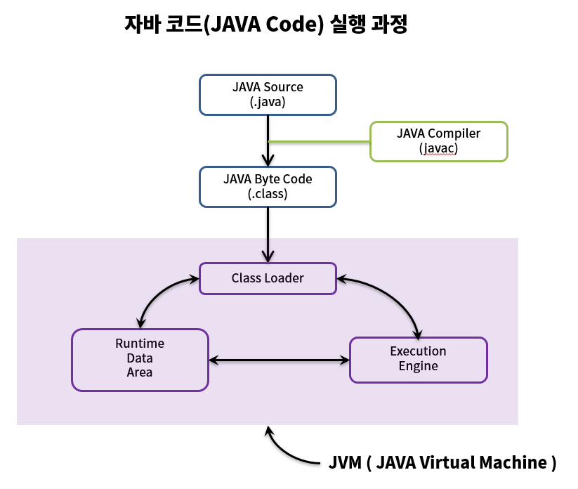
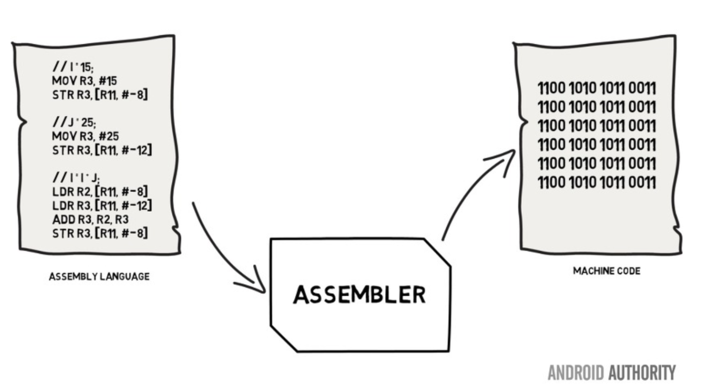
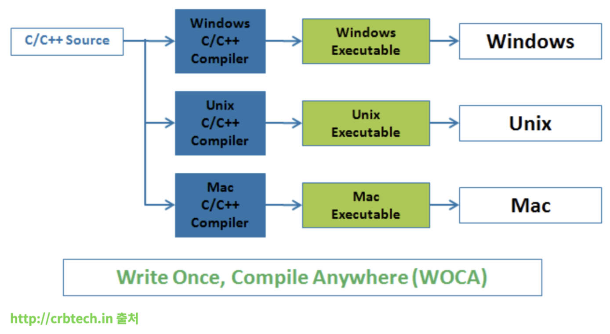
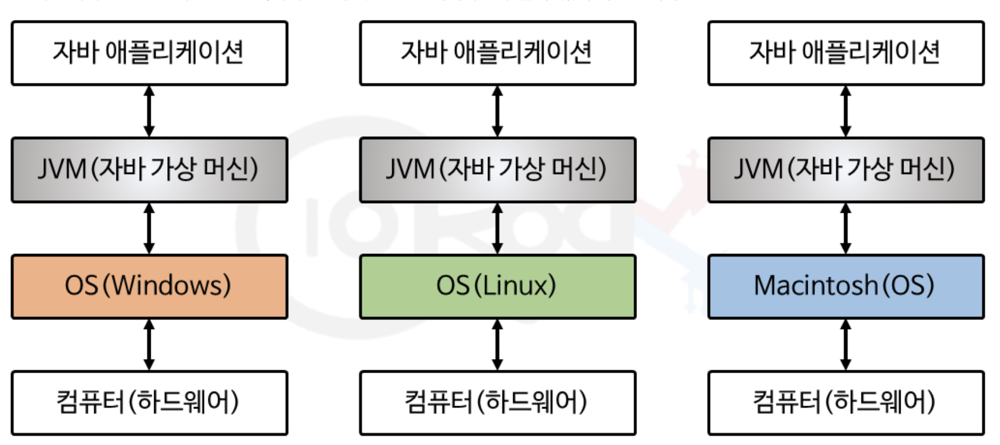
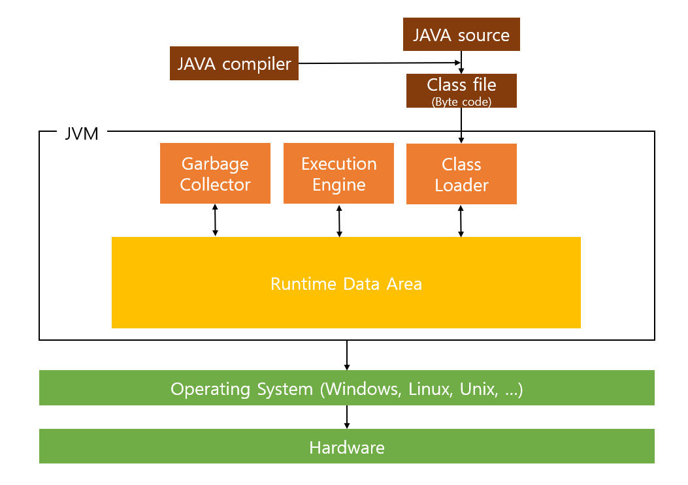
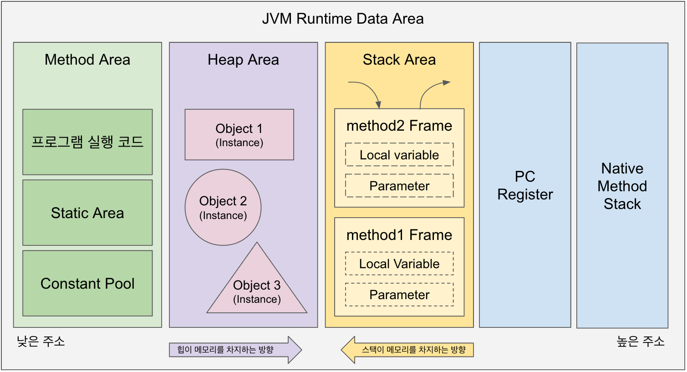

# Java의 특징
📌운영체제에 독립적
📌객체지향
- 절차지향과 비교
- 
 - (1)캡슐화(Encapsulation)
   - 실제 구현 내용을 외부로부터 감추는 기법. 캡슐 안에 든 약은 어떤 성분인지 외부에서 보이지 않고, 외부 접근으로부터 안전한 상태
   - 접근제어자 / getter / setter
- (2)상속(Inheritance)
  - 부모 클래스의 모든 멤버를 하위 클래스가 이어 받는 것. 코드의 중복을 제거한다.
- (3)추상화(Abstraction)
  - 공통된 속성(클래스의 필드 등으로)과 행위(메소드로)를 추출
- (4)다형성(Polymorphism)
  - 오버라이딩(인터페이스 추상메소드 구현) / 오버로딩(같은 메소드 이름으로 인자 값을 다양하게 입력해서 다양한 수행할 수 있다)
  - 업캐스팅 / 다운캐스팅
    - 사용할 수 있는 멤버 갯수를 조절한다.
    - 자식 클래스에만 있는 메소드를 실행해야 한다면?
📌자동메모리관리(Garbage Collection)
📌네트워크
- ServerSocket / Socket / Stream 객체
📌분산처리(transaction)
- transaction : DB 상태를 변화시키는 하나의 논리적 기능을 수행하기 위한 작업 단위.
- 원자성(Atomicity) : 트렌잭션은 데이터베이스에 모두 반영되거나 반영되지 않아야 한다
- 일관성(Consistency) : 트랜잭션이 성공적으로 완료되면 일관적인 데이터를 유지한다
- 독립성(Isolation) : 둘 이상의 트랜잭션이 동시에 실행되는 경우 각 트랜잭션은 서로의 연산에 끼어들 수 없다.
- 영구성(Durability) : 성공적으로 완료된 트랜잭션 결과는 영구적으로 반영된다.
📌멀티쓰레드(multi-thread)
- 
- (1)Thread 클래스 상속 (2)Runnable 인터페이스 구현.
- run( ) 메소드 오버라이 / start( ) 메소드 호출.
- 데몬쓰레드(daemon-thread) : 일반스레드가 종료되면 데몬스레드는 강제적으로 자동 종료된다. GC / 자동저장 / 동영상재생(미디어 플레이어 프로그램이 종료되면 같이 종료된다).
- 동기화(synchronized)
  - wait( ) / notify( ) / notifyAll( )
  - SharedArea / critical section
📌동적 로딩(Dynamic Loading)
- 인터프리터 방식의 단점 보완. 인터프리터 방식으로 실행하다가 적절한 시점에 바이트 코드(.class) 전체를 컴파일하여 기계어로 변경하고, 이후에는 해당 프로그램을 더 이상 인터프린팅 하지 않고 기계어로 직접 실행하는 방식.
- 기계어(컴파일된 코드)는 캐시에 보관하기 때문에 한 번 컴파일된 코드는 빠르게 수행하게 된다.
- 자바 컴파일러가 자바 프로그램 코드를 바이트 코드(.class)로 변환한 다음, 실제 바이트 코드를 실행하는 시점에 바이트 코드를 JIT 컴파일을 통해 기계어로 변환한다.
# JDK vs JRE
📌JDK(Java Development Kit) : 자바 개발 도구
- JDK = JRE + 개발에 필요한 실행파일 (javac.exe 등)
- Javac.exe는 Java Compiler를 의미한다. JDK를 설치하면 bin 폴더에 존재한다.

📌JRE(Java Runtime Environment) : 자바 실행 환경
- JRE = JVM + 클래스라이브러리(Java API)
- 자바로 작성된 응용프로그램이 실행되기 위한 최소 환경
# Java 실행방식
📌Hello.java ----javac.exe----> Hello.class ----java.exe----> 실행
- 
- 자바 컴파일러(javac.exe)가 소스파일(.java)로부터 클래스파일(.class)를 생성한다. 그 다음 운영체제에 맞는 JVM의 자바 인터프리터(java.exe)를 통해 컴파일 된 .class 파일을 컴퓨터가 이해할 수 있는 2진 코드로 번역한 후 명령을 실행한다.
- (1)프로그램의 실행에 필요한 클래스(\*.class 파일)를 로드한다 -> (2)클래스파일을 검사한다(파일형식/악성코드 체크) -> (3)지정된 클래스에서 main(String\[] args)를 호출한다.

# 인터프리트 언어 vs 컴파일 언어
📌공통점
- 고급 언어로 작성된 원시 프로그램(source program)을 목적 프로그램(object program)으로 번역하는 프로그램. 다만, 프로그램 번역 방식에 따라 구분된다.

📌컴파일러
- 고급 프로그래밍 언어로 작성한 Source Code를 컴퓨터 내부에서 사용 가능한 언어인 기계어(Machine Language)로 번역하고, 이를 실행가능 하게 만들어 주는 프로그램.
📌컴파일 언어
- 컴파일러를 통해 컴파일 타임에 전체 소스 코드를 한 번에 기계어로 변환 후 실행파일을 만든다.
- 컴파일 단계와 실행 단계가 각각 분리되어 있으며, 컴파일은 단 한번만 수행된다.
- 실행은 실행 파일을 실행시킴으로써 할 수 있으며, 실행시에는 컴파일 과정을 거치지 않고 실행만 하면 되므로 코드 실행 속도가 빠르다. 단, 프로젝트의 규모가 클 경우 컴파일 시간이 오래 걸릴 수 있다.
- C, C++, C# 등 ...

📌인터프리터
- 소스를 한꺼번에 번역하지 않고 명령어 문장 단위로 하나씩 읽어들여 번역과 동시에 실행하는 프로그램.
📌인터프리터 언어
- 컴파일 과정을 거치지 않는다.
- 한번에 적은 양의 내용을 추가하고 빠르게 테스트 해볼 수 있다.
- 프로그래밍을 대화식으로 할 수 있다.
-  Python, JavaScript, Ruby 등..

📌자바?
- JAVA는 다른 컴파일 언어들이 작동하듯이 컴파일러를 이용해 전체 코드를 한번에 번역한다. 여기서 사용하는 컴파일러를 자바 컴파일러(javac.exe)라고 한다. 이 자바 컴파일러는 Java 코드를 JVM이 실행시킬 수 있는 자바 바이트코드(.class)로 번역한다.
- 이렇게 작성된 자바 바이트 코드(.class)는 JVM의 자바 인터프린터(Java Interpreter)를 이용해 한 줄씩 실행된다. 자바 바이트 코트로 작성되어 있는 실행 프로그램을 자바 인터프리터(java.exe)가 한 줄씩 읽으면서 컴퓨터가 이해할 수 있는 2진 코드로 번역한 후 명령을 실행한다.

# Java가 플랫폼에 독립적인 이유
📌자바 응용프로그램은 운영체제나 하드웨어가 아닌 JVM하고만 통신한다. JVM은 자바 응용프로그램으로부터 전달받은 명령을 해당 운영체제가 이해할 수 있도록 변환하여 전달한다. 자바로 작성된 프로그램은 운영체제에 독립적이지만 JVM은 운영체제에 종속적이어서 썬에서는 여러 운영체제에 설치할 수 있는 서로 다른 버전의 JVM을 제공하고 있다. 그래서 자바로 작성된 프로그램은 운영체제와 하드웨어에 관계없이 실행 가능하며 이것을 '한번 작성하면, 어디서나 실행된다. (Write Once run anywhere)' 라고 표현하기도 한다.

📌기계어 -> 어셈블리어 -> C언어 -> 자바
- 어셈블리어 : 기계어의 가독성 개선 but 기계에 따라 어셈블리어가 영향을 받는다. (A사에서 만든 컴퓨터, B사에서 만든 컴퓨터에 따라 다른 어셈블리어가 존재한다...)
- 
- C : 단 하나의 소스 코드만 작성하며, 기계에 맞는 컴파일러가 각 기계에 맞는 목적 파일을 만든다. WOCA(Write Once Compile Anywhere -> but 운영체제마다 컴파일러가 다름... )
- 
- Java : WORA(Write Once Run Anywhere). C언어가 운영체제마다 컴파일러를 따로 구비해두고 있어야 하는 단점 보완. (아니 근데, 어차피 자바도 JRE를 운영체제에 따라 세팅해줘야 하는 거 아님? 그러면 컴파일러 구비해두는 거랑, JRE 세팅해두는 거랑 별 차이가 없는 것 같은데..?)
  - "플랫폼에 독립적" 이라는 말은 정확히, java 어플리케이션이 운영체제에 독립적이라는 의미다. JVM은 운영체제에 종속적이다. JVM에 포함된 JIT(Just In Time) Compiler가 바이트코드(,class)를 운영체제별로 다르게 변환해야 하기 때문이다.
  - 
  - .class 형식의 파일은 JVM이 읽을 수 있는 형식이다. 운영체제가 읽을 수 있는 형식이 아니다. 운영체제가 이해할 수 있게 하려면 한번 더 변환이 필요하다.
  - 자바는 `동적 로딩(Dynamic Loading)`을 지원하기 때문에, JVM은 해당 .class 파일이 필요한 시점에 로딩하여 해당 운영체제가 이해할 수 있는 언어로 다시 변환한다(bytecode는 기계어가 아니기 때문에 OS에서 바로 실행되지 않는다). 이를 JIT compiler가 수행한다.
  - JIT Compiler는 Windows, Linux 등 각 운영체제가 이해할 수 있는 언어로 변환하여 준다. JIT Compiler가 운영체제가 이해할 수 있는 언어로 변환을 잘 할 수 있도록 운영체제에 맞는 JIT Compiler를 설치해야 한다.

# JVM 구조

📌전체 구성
- 클래스 로더(Class Loader)
- 실행 엔진(Execution Engine)
  - 인터프리터(Interpreter)
  - JIT 컴파일러(Just-In-Time compiler)
  - 가비지 콜렉터(Garbage collector)
- 런타임 데이터 영역(Runtime Data Area)
  - 메소드 영역
  - 힙 영역
  - PC Register
  - 스택 영역
  - 네이티브 메소드
📌`클래스 로더(Class Loader)`

- (1)Loading : 클래스 파일을 가져와서 JVM 메모리에 로드
- (2)Linking : 클래스 파일을 사용하기 위해 검증
- (3)Initialization : 클래스 변수들을 적절한 값으로 초기화

📌`실행 엔진 (Excution Engine)` : 클래스 로더를 통해 런타임 데이터 영역에 배치된 바이트 코드를 명령어 단위로 읽어서 실행한다. 자바 바이트 코드(.class)는 JVM이 이해할 수 있는 중간 레벨로 컴파일 된 코드다. 실행 엔진은 이와 같은 바이트 코드를 실제로 JVM 내부에서 기계가 실행할 수 있는 형태로 변경해준다. 이 수행 과정에서 실행 엔진은 `인터프리터`와 `JIT 컴파일러` 두 가지 방식을 혼합하여 바이트 코드를 실행한다.
- 
- 인터프리터(Interpreter) : 바이트 코드 명령어를 하나씩 읽어서 해석하고 바로 실행한다. JVM안에서 바이트코드는 기본적으로 인터프리터 방식으로 동작한다. 다만 같은 메소드 라도 여러번 호출이 된다면 매번 해석하고 수행해야 돼서 전체적인 속도는 느리다.
- JIT 컴파일러(Just-In-Time Compiler) : 위의 Interpreter의 단점을 보완하기 위해 도입된 방식으로 반복되는 코드를 발견하여 바이트 코드 전체를 컴파일하여 Native Code로 변경하고 이후에는 해당 메서드를 더 이상 인터프리팅 하지 않고 캐싱해 두었다가 네이티브 코드로 직접 실행하는 방식이다.  하나씩 인터프리팅하여 실행하는것이 아니라, 컴파일된 네이티브 코드를 실행하는 것이기 때문에 전체적인 실행 속도는 인터프리팅 방식보다 빠르다.  하지만 바이트코드를 `Native Code(JAVA에서 부모가 되는 C언어나, C++, 어셈블리어로 구성된 코드를 의미한다)`로 변환하는 데에도 비용이 소요되므로, JVM은 모든 코드를 JIT 컴파일러 방식으로 실행하지 않고 인터프리터 방식을 사용하다 일정 기준이 넘어가면 JIT 컴파일 방식으로 명령어를 실행하는 식으로 진행한다.
- 가비지 컬렉터(Garbage Collector) : Heap 메모리 영역에서 더 이상 사용하지 않는 메모리를 자동으로 회수해준다. C언어의 경우 직접 개발자가 메모리를 해제해줘야 되지만, JAVA는 가비지 컬렉터를 통해 자동으로 메모리를 실시간 최적화 시켜준다. 개발자가 따로 메모리를 관리하지 않아도 되므로, 더욱 손쉽게 프로그래밍 할 수 있도록 해준다.

📌`런타임 데이터 영역(Runtime Data Area)`
- 
- 자바 애플리케이션을 실행할 때 사용되는 데이터들을 적재하는 영역.
- `(1) 메소드 영역(Method Area / Class Area / Static Area)`
  - JVM이 시작될 때 생성되는 공간으로 바이트 코드(.class)를 처음 메모리 공간에 올릴 때 초기화되는 대상을 저장하기 위한 메모리 공간. JVM이 동작하고 클래스가 로드될 때 적재돼서 프로그램이 종료될 때까지 저장된다.
  - 
  - 정적 필드와 클래스 구조만을 갖고 있다.
  - 
  - Rumtime Constant Pool : 메소드 영역에 존재하는 별도 관리영역. 상수 자료형을 저장하여 참조하고, 중복을 막는 역할을 수행한다.

- `(2) 힙 영역 (Heap Area)`
  - new 연산자로 생성되는 클래스와 인스턴스 변수 / 배열 타입 등 Reference Type이 저장되는 곳이다. 
  - 
  - 힙 영역에 생성된 객체와 배열은 Reference Type 으로, JVM 스택 영역의 변수나 다른 객체의 필드에서 참조된다. 즉, 힙의 참조 주소는 "스택"이 갖고 있고, 해당 객체를 통해서만 힙 영역에 있는 인스턴스를 핸들링(조작/접)할 수 있다. (만일 참조하는 변수나 필드가 없다면 의미 없는 객체가 되어 힙 영역에서 자동으로 제거된다)

 - `(3) 스택 영역(Stack Area)`
  - primitive 자료형을 생성할 때 저장하는 공간으로, 임시적으로 사용되는 변수나 정보들이 저장되는 영역
  - 
  - LIFO(Last In First Out) 구조. 메소드 호출 시마다 각각의 스택 프레임(그 메소드만을 위한 공간)이 생성되고 메소드 안에서 사용되는 값들을 저장하고, 호출된 메소드의 매개변수 / 지역변수 / 리턴 값 / 연산 시 일어나는 값들을 임시로 저장한다. 메소드 수행이 끝나면 프레임 별로 삭제된다.
  - 데이터 타입에 따라 stack과 heap에 저장되는 방식이 다르다.
    - primitive : 스택 영역에 직접 값을 가진다.
    - reference : 힙 영역이나 메소드 영역의 객체 주소 가진다.
    - 
    - 예를 들어 Name name = new Name("심두리")와 같이 객체를 생성한 경우, new에 의해 생성된 인스턴스는 Heap Area에 저장되고, Stack Area에는  참조변수 name이 저장된다.

# 스레드 vs 프로세스
📌프로세스(Process) : 작업 단위
 - 프로그램을 실행시켜 정적인 프로그램이 동적으로 변하여 돌아가고 있는 상태, 즉 컴퓨터에서 작업 중인 프로그램. 프로그램을 실행하면 컴퓨터 메모리에 올라가게 되고, 운영체제로부터 시스템 자원(CPU)을 할당받아 프로그램 코드를 실행시킨다.

📌스레드(Thread) : 실행 흐름 단위
- 
- 크롬 브라우저가 실행 된다 = 프로세스 하나가 생성된다.
- 브라우저에서 (1)파일다운 (2)온라인 쇼핑 (3)게임 ... 등 여러 가지 작업을 할 수 있다.

📌일반적으로 하나의 프로그램은 하나 이상의 프로세스를 가지고 있고, 하나의 프로세스는 반드시 하나 이상의 스레드를 갖는다. 즉, 프로세스를 생성하면 기본적으로 하나의 main 스레드가 생성된다. 복수의 스레드는 개발자가 직접 프로그래밍하여 위치시켜주어야 한다.

# GC(Garbage Collection)
📌가비지 컬렉션(Garbage Collection, GC)은 자바의 메모리 관리 방법 중의 하나로 JVM(자바 가상 머신)의 Heap 영역에서 동적으로 할당했던 메모리 중 필요 없게 된 메모리 객체(garbage)를 모아 주기적으로 제거하는 프로세스를 말한다.
- C / C++ 언어에서는 GC 없이 수동으로 메모리 할당과 해제를 일일이 해줘야 했었다. Java에서는 GC가 메모리 관리를 대행해주기 때문에, Java 프로세스가 한정된 메모리를 효율적으로 사용할 수 있게 하고, 개발자는 메모리 관리 문제에 골몰하지 않고 개발에만 집중할 수 있다.
- 
- 자동으로 처리하는데, 메모리가 정확히 언제 해제되는지 정확하게 알 수 없어 제어하기 힘들고, GC가 동작하는 동안에는 다른 동작을 멈추기 때문에 `오버헤드`가 발생한다(STW, Stop-The-World).
- 이러한 STW 등을 최적화하기 위해 다양한 GC 알고리즘(Serial / Parallel / G1 / ZGC ... )이 개발 되고 있다. 상황에 따라 적절한 GC 방식을 설정해서 사용할 수 있다.

### reference
- https://velog.io/@outgrow0905/java%EB%8A%94-%EC%9A%B4%EC%98%81%EC%B2%B4%EC%A0%9C%EC%97%90-%EB%8F%85%EB%A6%BD%EC%A0%81%EC%9D%B4%EB%9D%BC%EB%A9%B4%EC%84%9C-%EC%99%9C-%EC%84%A4%EC%B9%98%ED%95%A0-%EB%95%8C%EC%97%90%EB%8A%94-%EC%9A%B4%EC%98%81%EC%B2%B4%EC%A0%9C%EC%97%90-%EB%A7%9E%EC%B6%B0%EC%84%9C-%EC%84%A4%EC%B9%98%ED%95%B4%EC%95%BC-%ED%95%A0%EA%B9%8C
- https://jaeseongdev.github.io/development/2021/03/08/%EC%9E%90%EB%B0%94%EC%9D%98_%EA%B0%80%EC%9E%A5_%ED%81%B0_%EC%9E%A5%EC%A0%90_%EC%9A%B4%EC%98%81%EC%B2%B4%EC%A0%9C%EC%97%90_%EB%8F%85%EB%A6%BD%EC%A0%81%EC%9D%B4%EB%8B%A4/
- https://doozi0316.tistory.com/entry/1%EC%A3%BC%EC%B0%A8-JVM%EC%9D%80-%EB%AC%B4%EC%97%87%EC%9D%B4%EB%A9%B0-%EC%9E%90%EB%B0%94-%EC%BD%94%EB%93%9C%EB%8A%94-%EC%96%B4%EB%96%BB%EA%B2%8C-%EC%8B%A4%ED%96%89%ED%95%98%EB%8A%94-%EA%B2%83%EC%9D%B8%EA%B0%80
-  [https://inpa.tistory.com/entry/JAVA-☕-JVM-내부-구조-메모리-영역-심화편](https://inpa.tistory.com/entry/JAVA-%E2%98%95-JVM-%EB%82%B4%EB%B6%80-%EA%B5%AC%EC%A1%B0-%EB%A9%94%EB%AA%A8%EB%A6%AC-%EC%98%81%EC%97%AD-%EC%8B%AC%ED%99%94%ED%8E%B8) [Inpa Dev 👨‍💻:티스토리]
- [https://inpa.tistory.com/entry/JAVA-☕-가비지-컬렉션GC-동작-원리-알고리즘-💯-총정리](https://inpa.tistory.com/entry/JAVA-%E2%98%95-%EA%B0%80%EB%B9%84%EC%A7%80-%EC%BB%AC%EB%A0%89%EC%85%98GC-%EB%8F%99%EC%9E%91-%EC%9B%90%EB%A6%AC-%EC%95%8C%EA%B3%A0%EB%A6%AC%EC%A6%98-%F0%9F%92%AF-%EC%B4%9D%EC%A0%95%EB%A6%AC) [Inpa Dev 👨‍💻:티스토리]