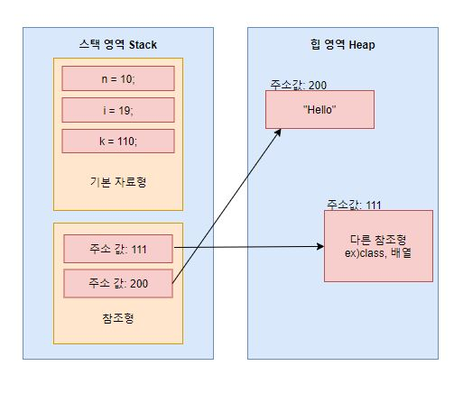

# 기본자료형 vs 참조자료형
📌기본형 변수는 실제 값(data)를 저장한다. 참조형 변수는 어떤 값이 저장되어 있는 주소(memory address)를 값으로 갖는다(4byte 정수). 자바는 C언어와 달리 참조형 변수 간의 연산을 할 수 없으므로 실제 연산에 사용되는 것은 모두 기본형 변수다.

📌기본자료형 (Primitive)


📌참조자료형 (Reference) : 8가지 기본형을 제외한 나머지 타입.
- 클래스 (Class)
- 인터페이스 (Interface)
- 열거형 (Enum)                                                                                               


📌기본형과 참조형 모두 변수의 공간이 스택 메모리에 생성되지만 그 공간에 저장되는 값의 의미가 다르다. 기본형은 스택 메모리에 생성된 공간에 실제 변수의 값(리터럴)을 저장하는 반면, 참조형은 실제 데이터의 값은 힙 메모리에 저장하고, 스택 메모리의 변수 공간에는 실제 변수값이 저장된 힙 메모리의 주소(위치값)를 저장한다.
- 자바는 힙 메모리에 직접 접근할 수 없으므로, 참조형 변수의 실제 데이터 값에 접근하기 위해서는 반드시 위치값을 저장하고 있는 참조변수가 필요하다.



🥕call by value? call by reference?
- 자바는 call by value만 쓴다 (feat. 자바를 만든 제임스 고슬링)
- 주소 값이 stack에 저장되는데 매개변수 값으로 이러한 주소값이 복사되어 전달된다. (C / C++ 은 포인터가 있어서 명시적으로 매개변수를 넘겨줌)
- 자바 진영에서는 call by value / call by address


# String

📌java.lang 패키지에 포함되고, Object 클래스를 상속하고 있으며, Serializable 등의 interface를 구현하고 있다.
📌문자열을 저장하고 이를 다루는데 필요한 여러 메소드를 제공한다.
📌한번 생성된 String인스턴스가 갖고 있는 문자열은 읽어 올 수만 있고, 변경할 수는 없다.  예를 들어 아래 코드와 같이 + 연산자를 이용하여 문자열을 결합하는 경우 인스턴스 내의 문자열이 바뀌는 것이 아니라, 새로운 문자열("ab")이 담긴 String  인스턴스가 생성된다.
```java
String a = "a";
String b = "b";
String a = "a+b";
```
📌문자열을 만들 때는 (1)문자열 리터럴을 지정하는 방법 (2)String 클래스의 생성자를 사용해서 만드는 방법. 두 가지가 있다.
```java
String str1 = "abc";
String str2 = "abc";
String str3 = new String("abc");
String str4 = new String("abc");
```

이 그림은 동등성 / 동일성 개념과 이어진다.

📌여러 메소드가 있다...
📌casting
📌StringBuffer / StringBuilder

🥕String 좀 특이하다. 참조자료형임에도 불구하고, 기본형처럼 선언할 수 있고, + 연산자도 사용할 수 있다.
🥕불변성 / 공유성
🥕"a" "b" "ab" 연산을 해도 각각이 힙영역에 별도의 메모리를 할당 받는다.
- 문자열이 동적으로 변할 때 (append) 등 연산 결과를 항상 메모리에 할당을 하니까 메모리 영역을 많이 차지 하게 된다 -> 이런 상황에서는 String Builder / String Buffer를 사용해서 성능을 개선한다.
🥕String constant pool : 자주 사용되는 String을 미리 메모리에 할당.
🥕String literal
🥕StringBuilder vs StringBuffer
- String의 불변성으로 인한 이슈를 개선


# 동등성(**equality)** vs 동일성(identity)
📌동일성은 동일하다는 뜻으로, 두 개의 객체가 완전히 같은 경우를 의미한다. 완전히 같다는 뜻은 두 객체가 사실상 하나의 객체로 봐도 무방하며, 주소 값이 같기 때문에 두 변수가 같은 객체를 가리키게 된다.

📌해당 변수가 동일한지는 == 연산자를 통해 판별할 수 있다.

📌동등성은 동등하다는 뜻으로 두 개의 객체가 같은 정보를 갖고 있는 경우를 의미힌다. 동등성은 변수가 참조하고 있는 객체의 주소가 서로 다르더라도 내용만 같으면 두 변수는 동등하다고 할 수 있다('동일하다'는 '동등하다'의 충분조건). 동등하다고 항상 동일한 것은 아니다. 해당 변수가 동등한지는 equals 연산자를 통해 판별할 수 있다.

📌주의 !! 어떠한 객체든 equals 연산자만 사용하면 두 객체에 대한 동등성 판단이 가능한 것은 아니다.
```java
public boolean equals(Object obj) {
  return (this == obj);
}
```
이 메소드는 모든 객체의 조상인 Object 객체에서 정의하고 있는 equlas()메소드다. 반환 형태를 보면 알 수 있듯, 단순히 동일성 비교만 하고 있다. 즉, 해당 메소드를 자식 객체에서 재정의하지 않는 이상 equals()연산자는 \==연산자와 다르지 않다.

📌String 클래스에서는 equals() 메소드를 오버라이딩하여 다음과 같이 정의하고 있다.
```java
public boolean equals(Object anObject) {
  if(this == anObject) {
    return true;
  }
  if (anObject instanceof String) {
    String anotherString = (String) anObject;
    int n = value.length;
    if (n == anotherString.value.length) {
      char v1[] = value;
      char v2[] = anotehrString.value;
      int i = 0;
      while (n-- != 0) {
        if (v1[i] != v2[i])
          return false;
		 i++
      }
      return true;
    }
  }
  return false;
}
```
equals()의 인자로 전달된 object 문자열을 비교하고 있다. \== 연산자를 통해 두 객체의 `동일성 여부`를 판단하고, 두 객체가 동일하지 않다면 String 객체로 형변환 가능한지 여부를 확인한 뒤, 문자 하나 하나가 같은지 비교한다. 만약 모든 문자가 같다면 두 객체의 내용이 같은 것이므로 `동등`하다고 판별할 수 있다.


# Object Class
- toString()
- equals()
- hashCode()


📌Object 클래스는 전체 클래스 계층 구조에서 root class에 해당한다. 모든 클래스는 부모 클래스로 Object 클래스를 상속한다.  (extends .. 로 명시적으로 상속하지 않아도 자동으로 상속이 이뤄진다. 만일 다른 클래스를 extends.. 하더라도 클래스는 1개밖에 상속할 수 없지만, 상속한 그 부모 클래스가 Object를 상속할 것이기 때문에 결국 모든 클래스는 Object 클래스를 상속받는 형태가 된다.)

## public String toString()
```java
public String toString() {return getClass().getName() + "@" + Integer.toHexString(hashCode()); }
```
- 객체 자신의 정보(해당 인스턴스에 대한 정보와 주소(해쉬코드))를 문자열로 반환
  - 해쉬코드는 인스턴스의 주소를 hashing하여 변환한 값으로, 인스턴스마다 다르게 반환된다.
- 객체의 이름이나 주소값이 아닌, 객체의 고유 정보(담겨 있는 데이터)를 출력하고 싶을 때는 오버라이딩하여 반환값을 다르게 설정한다.
- 객체를 출력하는 명령 (예를 들면, Student student = new Stundet(); System.out.println(student))을 수행할 때, 변수에 toString()를 호출하지 않아도 자동으로 붙여서 호출한다.

## public boolean equals(Object obj)
```java
public boolean equals(Object obj) {
	return (this == obj);
}
```
- 객체 자신과 객체 obj가 같은 객체인지 알려준다 (같으면 true)


## public native int hashCode()
- 객체의 주소값을 해쉬코드로 반환한다. 객체의 주소가 아닌 다른 데이터의 주소를 반환하려면 오버라이딩하여 재정의 해주어야 한다.
- native? native 키워드가 들어간 메소드는 OS가 가지고 있는 메소드를 뜻한다. JNI(Java Native Interface)는 C나 저수준의 언어로 작성된 native 코드를 JVM에 적재하고 실행하는 기능을 한다. 이러한 native 코드 중 하나가 hashCode() 메소드다. 이러한 네이티브 메소드는 OS에 C언어로 작성되어 있어서 그 안의 내용은 볼 수 없고, 호출해서 사용하기만 할 수 있다.


📌equals 메소드를 override 하면서 hashcode 메소드를 override 하지 않으면, hash 값을 사용하는 Collection Framework(HashSet / HashMap / HashTable)을 사용할 때 문제가 발생한다.
```java
package overridesample;  
  
import java.util.*;  
  
class Human {  
    public String name;  
  
    public Human(String name) {  
        this.name = name;  
    }  
  
    public boolean equals(Object obj) {  
        if (this == obj) return true;  
        if (obj == null || getClass() != obj.getClass()) return false;  
        Human so = (Human) obj;  
        return Objects.equals(name, so.name);  
    }  
}  
  
public class ClassTest {  
    public static void main(String[] args) {  
        Human h1 = new Human("고라니");  
        Human h2 = new Human("고라니");  
  
        //두 객체는 '동일'하지는 않음  
        System.out.println(h1); //overridesample.Human@b4c966a  
        System.out.println(h2); //overridesample.Human@2f4d3709  
  
        //두 객체의 해쉬 코드  
        System.out.println(h1.hashCode()); // 189568618  
        System.out.println(h2.hashCode()); // 793589513  
  
        //해쉬코드가 달라도, equals 메소드를 재정의했으므로 true 반환.  
        System.out.println(h1.equals(h2));  
  
        //리스트를 생성하고 두 객체를 추가한다.  
        List<Human> list = new ArrayList<Human>();  
        list.add(h1);  
        list.add(h2);  
        System.out.println(list.size()); //2  
  
        //중복을 허용하지 않는 Set 자료형  
        Set<Human> set = new HashSet<Human>();  
        set.add(h1);  
        set.add(h2);  
        System.out.println(set.size()); //2  
    }  
}
```

- hash 값을 사용하는 Collection은 객체가 논리적으로 같은지 비교할 때 위 그림과 같은 과정을 거친다. (1)컬렉션에 데이터가 추가되면 그 데이터의 hashcode()리턴 값을 컬렉션에 가지고 있는지 비교한다 (2)해쉬코드가 같으면 다음으로 equals()메소드 리턴 값을 비교하고 (3)true이면 논리적으로 같은 객체로 판단한다.
- 위 코드에서 HashSet에 Human 객체를 추가할 때도 위와 같은 과정으로 중복 여부를 판단하고 HashSet에 추가한다. Human 클래스에서는 hashCode 메소드가 오버라이드 되지 않아서 Object 클래스의 hashCode 메소드가 사용되고, 객체마다 다른 값을 리턴했다. 결국, h1 / h2 객체는 euqals 메소드로 비교 하기 전에 서로 다른 hashCode 메소드 리턴값으로 인해 다른 객체로 판단되어 size 메소드의 반환값이 '2'로 나온 것이다. 이런 오작동을 방지하기 위해 hashCode 메소드도 오버라이드 하여 equals 메소드의 반환값이 true인 두 객체는 같은 해쉬코드를 갖도록 오버라이드 할 필요가 있다.

🥕동일한 객체를 판단하는 기준(자바에서)
- h1.equals(h2) == ture 면, hashCode(h1) == hashCode(h2) true 여야한다.
- hashCode(h1) == hashCode(h2)가 true면, h1.equals(h2) == true여야한다. 이 명제는 항상 참임을 보장 받지는 않는다.
- hashCode(h1) == hashCode(h2)가 true면, h1.equals(h2) == false다. -> 해쉬충돌 상황 (논리적으로 가능하다)


# JCF(Java Collections Framework)

- List
- Map
- Set

📌객체들을 효율적으로 추가 / 삭제 / 검색할 수 있도록 한다. 데이터를 저장하는 자료 구조와 데이터를 처리하는 알고리즘을 구조화하여 클래스로 구현해 놓은 것.

📌JDK 1.2 이전까지는 Vector / Hashtable, Properties와 같은 컬렉션 클래스들을 서로 다른 각자의 방식으로 처리해야 했으나, JDK1.2부터 컬랙션 프레임워크가 등장하면서 다양한 종류의 컬렉션 클래스가 추가되고 모든 컬렉션 클래스를 표준화된 방식으로 다룰 수 있도록 체계화되었다.

📌왜 사용할까?
- 인터페이스와 다형성을 이용한 객체지향적 설계로 표준화되어 있기 때문에 사용법을 익히기 편리하고 재사용성이 높다.
- 데이터 구조 및 알고리즘을 고성능으로 구현한 것이어서 프로그램 성능과 품질을 향상시킨다.

📌주의 !! 컬렉션 프레임워크에 저장할 수 있는 데이터는 오로지 객체(Object) 뿐이다. primitive 타입은 포함시킬 수 없다. (이 문제는 wrapper class 개념으로 이어진다)

## Iterable 인터페이스

- 컬렉션 인터페이스의 가장 최상위 인터페이스
- 컬렉션에 담긴 요소들을 하나씩 순회할 때 이터레이터 객체를 활용하는데, 이러한 이터레이터 객체를 관리하는 인터페이스스

## List 인터페이스

📌특징
- 저장 순서가 유지되어야 하는 컬렉션을 구현하는 데 사용
- 같은 요소의 중복 저장 허용
- index로 요소에 접근
- 배열(array)과 달리 자료형 크기가 고정 되어 있지 않고, 데이터 양에 따라 동적으로 변한다.
- 요소 사이에 빈공간을 허용하지 않는다 -> 삽입/삭제 할 때마다 배열 이동이 일어난다.


## Queue 인터페이스

📌특징
- 선입선출 FIFO(First In First Out) 구조
- 필요에 따라 우선순위를 부여하여 정렬하는 PriorityQueue 클래스 / 양쪽으로 넣고 빼는 것이 가능한 ArrayDeque 클래스 등으로 구현한다.


## Set 인터페이스

📌특징
- 데이터 중복을 허용하지 않고 순서를 유지하지 않는 데이터 집합.
- 순서 자체가 없으므로 인덱스를 검색해서 가져오는 메소드도 없다.
- 중복 저장이 불가능하기 때문에 null 값도 하나만 저장할 수 있다.

📌HashSet 클래스

- 배열과 연결 노드를 결합한 자료구조 형태.
- 가장 빠른 임의 검색 접근 속도를 가진다.
- 추가 / 삭제 / 검색 / 접근성 모두 뛰어나다.
- 순서를 전혀 예측할 수 없다.

```java
Set<Integer> hashSet = new HashSet<>();

hashSet.add(10);
hashSet.add(20);
hashSet.add(30);
hashSet.add(10); // 중복된 요소 추가

hashSet.size(); // 3 - 중복된건 카운트 X

hashSet.toString(); // [20, 10, 30] - 자료 순서가 뒤죽박죽
```


📌TreeSet 클래스

- 이진 검색 트리 자료구조 형태로 데이터 저장.
- 중복 허용하지 않고, 순서 없다.
- 데이터를 (알아서) 정렬하여 저장하고 있다.
- 정렬 / 검색 / 범위 검색에서 성능이 좋다.
```java
Set<Integer> treeSet = new TreeSet<>();

treeSet.add(7);
treeSet.add(4);
treeSet.add(9);
treeSet.add(1);
treeSet.add(5);

treeSet.toString(); // [1, 4, 5, 7, 9] - 자료가 알아서 정렬됨
```


## Map 인터페이스

📌특징
- 키(key)와 값(value) 쌍으로 연관되어 이루어진 데이터 집합
- value는 중복 저장할 수 있지만, key는 해당 map에서 고유하다
- 기존에 저장된 데이터와 중복된 key 값을 저장하면, 기존 값은 사라지고 마지막에 입력한 값만 저장된다.
- 저장 순서가 유지되지 않는다.

📌HashMap 클래스

- 배열과 연결이 결합된 Hashing 형태로, key / value를 묶어 하나의 데이터로 저장한다.
- 중복을 허용하지 않고, 순서를 보장하지 않는다.
- key / value 로 null값을 허용한다.
- 추가 / 삭제 / 검색 / 접근성 모두 뛰어나다.
- 비동기로 작동하므로 멀티쓰레드 환경에서 어울리지 않는다.
```java
Map<String, String> hashMap = new HashMap<>();

hashMap.put("love", "사랑");
hashMap.put("apple", "사과");
hashMap.put("baby", "아기");

hashMap.get("apple"); // "사과"

// hashmap의 key값들을 set 집합으로 반환하고 순회
for(String key : hashMap.keySet()) {
    System.out.println(key + " => " + hashMap.get(key));
}
/*
love => 사랑
apple => 사과
baby => 아기
*/
```


# Array vs List vs ArrayList
📌Array (배열)
``` java
public static void main(String[] args) {

	int[] arr = new int[5];
	int[] arr = {42, 51, 64, 33, 12};
	
	System.out.println(arr) //[I@10f87f48
}
```
형태로 사용하는 reference 타입 중 하나
- 처음 선언한 배열의 크기(5)는 변경할 수 없다(정적 할당;static allocation) -> 메모리 관련 이슈가 발생할 수 있다(너무 크게 설정하면 낭비가 되고, 너무 적게 설정하면 데이터를 담을 수 없게 된다)
- 배열의 element는 각각 메모리(Heap)에 연속적으로 나열되어 할당된다(참조변수 arr에는 첫번째 인덱스의 주소값이 들어간다.) -> index를 통한 접근속도가 빠르다.
- index에 위치한 하나의 데이터를 삭제하더라도 해당 index에 빈공간으로 계속 남는다(그래서 .. 삭제 후 데이터를 조회해보려고 했는데 배열의 요소를 제거하는 메소드를 지원하지 않는다.. ! -> 삭제하려면 list로 변환해서 작업해야 하는 것 같다..)
- Generic을 활용할 수 없다.


📌List
- Collection Framework에 포함되어 있는 Interface 중 하나.
- 길이가 가변적이다(동적 할당;dynamic allocation) -> 메모리 관리에 유리하다.
- 데이터들이 연속적으로 나열된다. (메모리에 연속적으로 나열되지 않고, 각 데이터들은 주소(reference)로 연결되어 있다) -> 포인터(주소)로 각 데이터들이 연결되어 있기 때문에 해당 데이터에 연결된 주소만 바꿔주는 방식으로 삽입·삭제를 쉽게할 수 있다 (ArrayList는 예외)
- 데이터(element) 사이에 빈 공간을 허용하지 않는다.


📌ArrayList 클래스

- 배열을 이용하여 만든 리스트.
- 데이터 저장순서가 유지되고 중복 허용(list 인터페이스 구현)
- 크기를 변경해야 하는 경우 새로운 Array를 생성해야 하고, 데이터를 복사해야 한다.
- 크기 변경을 피하기 위해 충분히 큰 배열을 생성하면 메모리 낭비가 심하다.
- 단방향 포인터 구조로 자료에 대한 순차적인 접근에 강점이 있어 조회가 빠르다.
  - 비순차적인 데이터의 삽입 / 삭제가 느리다. (단, 순차적으로 추가/삭제 하는 경우 가장 빠르다)


🤔더 공부해보기
- 실제 성능 테스트 (삽입 / 삭제 / 조회 등...) (https://jerry92k.tistory.com/63) 이 링크의 블로그 포스팅을 보면 Array > ArrayList > LinkedList 순으로 임의의 값 탐색 속도가 빠르다.


# ArrayList vs LinkedList
📌LinkedList 클래스


-  노드(객체)를 연결하여 리스트처럼 만든 컬렉션 (배열X)
- 데이터의 중간 삽입/삭제가 빈번할 경우 빠른 성능.
- 임의 요소에 대한 접근 성능이 좋지 않다.
- List인터페이스와 Queue 인터페이스를 동시에 상속받고 있기 때문에 스택 / 큐 두 가지 자료구조로 응용할 수 있다.
- Doubly LinkedList(양방향 포인터 구조)로 이루어져 있다.


📌ArrayList vs LinkedList


# Generic
📌클래스 내부에서 사용할 데이터 타입을 외부에서 지정하는 기법. 객체별로 다른 타입의 자료가 저장될 수 있도록 한다.

📌다양한 타입의 객체들을 다루는 메소드나 컬렉션 클래스에 컴파일 시 타입체크를 해준 기능을 한다 -> 다른 형태의 데이터가 포함되는 예외를 막아준다.

📌타입 매개변수 : 컬렉션 클래스나 메소드에서 사용할 내부 데이터 타입을 파라미터 주듯이 외부에서 지정한다. 즉, 타입을 변수화한 기능을 구현한다.
- 기호의 종류만 다를 뿐, 임의의 참조형 타입을 의미한다.
  - E : 원소 (Element)
  - K : 키 (Key)
  - T : 타입 (Type)
  - V : 값 (Value)
- 할당 받을 수 있는 타입은 Reference 타입으로 제한된다.
  - 다형성 원리가 적용되어,  업캐스팅을 통해 자식에 해당하는 객체도 할당할 수 있다. -> 불필요한 캐스팅을 없애서 성능을 향상시킬 수 있다.
```java
Apple[] arr = { new Apple(), new Apple(), new Apple() };
FruitBox box = new FruitBox(arr);

// 가져온 타입이 Object 타입이기 때문에 일일히 다운캐스팅을 해야함 - 쓸데없는 성능 낭비
Apple apple1 = (Apple) box.getFruit(0);
Apple apple2 = (Apple) box.getFruit(1);
Apple apple3 = (Apple) box.getFruit(2);
```
```java
// 미리 제네릭 타입 파라미터를 통해 형(type)을 지정해놓았기 때문에 별도의 형변환은 필요없다.
FruitBox<Apple> box = new FruitBox<>(arr);

Apple apple = box.getFruit(0);
Apple apple = box.getFruit(1);
Apple apple = box.getFruit(2);
```
- 1개 이상의 타입 매개변수를 지정할 수 있다.


📌Generic 클래스
- 클래스 선언문 옆에 Generic 타입 매개변수가 쓰인 경우.
```java
class Sample<T> {
    private T value; // 멤버 변수 val의 타입은 T 이다.

    // T 타입의 값 val을 반환한다.
    public T getValue() {
        return value;
    }

    // T 타입의 값을 멤버 변수 val에 대입한다.
    public void setValue(T value) {
        this.value = value;
    }
}
```


📌Generic 인터페이스
- 인터페이스를 implements 한 클래스에서도 오버라이딩한 메소드를 generic 타입에 맞춰 똑같이 구현해 주어야 한다.
```java
interface Sample<T> {
    public void addElement(T t, int index);
    public T getElement(int index);
}


class Sample_Test<T> implements Sample<T> {
    private T[] array;

    public Sample_Test() {
        array = (T[]) new Object[10];
    }

    @Override
    public void addElement(T element, int index) {
        array[index] = element;
    }

    @Override
    public T getElement(int index) {
        return array[index];
    }
}


public static void main(String[] args) {
    Sample<String> sample = new Sample<>();
    sample.addElement("This is string", 5);
    System.out.println(sample.getElement(5)); //This is string
}
```
- generic에 extends 키워드를 붙여주면 해당 클래스와 그 하위 타입들만 입력할 수 있도록 타입 파라미터 범위를 제한할 수 있다. (Number를 입력하면 그 하위 타입인 Integer, Double 등만 입력할 수 있다)


📌Generic 함수형 인터페이스
```java
// 제네릭으로 타입을 받아, 해당 타입의 두 값을 더하는 인터페이스
interface IAdd<T> {
    public T plus(T x, T y);
}

public class Main {
    public static void main(String[] args) {
        // 제네릭을 통해 람다 함수의 타입을 결정
        IAdd<Integer> test = (x, y) -> x + y; // 매개변수 x와 y 그리고 반환형 타입이 int형으로 설정된다.
        
        int result = test.plus(10, 20);
        System.out.println(result); // 30
    }
}
```


🤔더 공부해보기
- 재귀적 타입 한정 (Comparable 인터페이스)
- generic 캐스팅
- generic 와일드카드
  - generic 공변성
- generic 타입 소거거


# Wrapper Class
📌기본 자료형을 감싸는(?) 클래스. 기본형 값을 담는 객체를 생성하는 것.
- int 형의 Wrapper Class 이름 주의. 다른 Wrapper Class들은 primitive 이름에 첫 글자만 대문자로 바꾼 형태인데, int 형만 예외로 Integer.

📌왜 사용할까?
- 클래스에서 제공하는 유용한 메소드 / 필드를 활용할 수 있다.
  - Integer.MAX(MIN)\_VALUE 
- Generic을 활용할 수 있다. Generic에 사용되는 매개변수는 Object 형만 받을 수 있다. 즉, 참조형 변수만 입력할 수 있는데, Wrapper 클래스를 활용하면 기본형을 Generic에 활용할 수 있다.


# 함수형 프로그래밍

함수형 프로그래밍을 논하려면, 우선 프로그래밍 패러다임이 무엇인지 알아야 할 것 같다

📌프로그래밍 패러다임(Programming Paradigm)
프로그래밍 패러다임은 프로그래머에게 프로그래밍에 대한 특정한 관점을 갖게 하고, 어떻게 코드를 작성할지 결정하는 역할을 한다. 크게 명령형(Imperative) 프로그래밍 / 선언형(declarative) 프로그래밍으로 나눌 수 있다.
- 명령형 프로그래밍
  - 무엇(what)을 할 것인지 나타내기보다는 어떻게(how) 할 건지 설명하는 방식. 즉, `코드가 어떻게 동작해야 하는지`를 작성한다.
- 선언형 프로그래밍
  - 어떻게 할건지(how)를 나타내기보다 무엇(what)을 할 건지 설명하는 방식. 즉, 

📌함수형 프로그래밍이 주목받게 된 배경

- 협업 / 프로젝트의 규모 증가 → 다른 사람이 작성한 코드를 쉽게 이해할 수 있어야 한다.

📚[프로그래밍] 함수형 프로그래밍(Functional Programming)이란?[https://mangkyu.tistory.com/111](https://mangkyu.tistory.com/111)


### reference
📚 [velog.io/@1205kjw/2.3.1-기본-자료형과-참조-자료형의-차이](https://velog.io/@1205kjw/2.3.1-%EA%B8%B0%EB%B3%B8-%EC%9E%90%EB%A3%8C%ED%98%95%EA%B3%BC-%EC%B0%B8%EC%A1%B0-%EC%9E%90%EB%A3%8C%ED%98%95%EC%9D%98-%EC%B0%A8%EC%9D%B4)
📚 https://blog.naver.com/dkfm214/221912369571
📚 [Java 동일성(identity)과 동등성(equality)](https://steady-coding.tistory.com/534)
📚[https://inpa.tistory.com/entry/JAVA-☕-Object-클래스와-상위-메소드-재정의-활용-총정리](https://inpa.tistory.com/entry/JAVA-%E2%98%95-Object-%ED%81%B4%EB%9E%98%EC%8A%A4%EC%99%80-%EC%83%81%EC%9C%84-%EB%A9%94%EC%84%9C%EB%93%9C-%EC%9E%AC%EC%A0%95%EC%9D%98-%ED%99%9C%EC%9A%A9-%EC%B4%9D%EC%A0%95%EB%A6%AC) [Inpa Dev 👨‍💻:티스토리]
📚 [https://inpa.tistory.com/entry/JCF-🧱-Collections-Framework-종류-총정리](https://inpa.tistory.com/entry/JCF-%F0%9F%A7%B1-Collections-Framework-%EC%A2%85%EB%A5%98-%EC%B4%9D%EC%A0%95%EB%A6%AC) [Inpa Dev 👨‍💻:티스토리]
📚[자바JAVA-List Interface](https://st-lab.tistory.com/146)